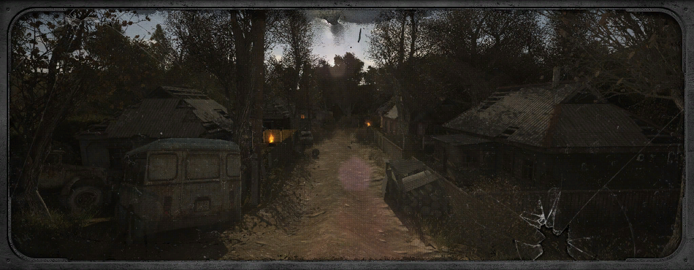
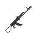
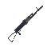
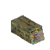
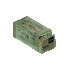
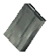
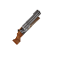
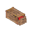

  

<h1 align="center">Stalker SHOC Weapon Pack</h1>

  <b>For Hytale Modjam</b>

---

## Requirements

For the mod to work correctly, **MultipleHUD v1.04** **must** be installed and placed in the `Mods` folder on `Save`.

---

## Controls

* Load ammo into magazine: **Hold LMB**
* Unload ammo from magazine: **Hold RMB**
* Insert magazine into unloaded rifle: Put magazine into **Utils** and press **R**
* Remove magazine from loaded rifle: Make sure hotbar has free slot and press **R**

  <b>A rifle taken from Creative mode with a magazine will not work.</b>

---

## Implements

* Added AK-74 with a 30-round magazine and an RPK 45-round magazine.

    
    
    
    

* Added LR-300 with 5.56 ammo and magazine

    
    
    
    

* Added Sawn-off shotgun with 12x70 ammo.

    
    

* Added craft stations for ammo and guns.
